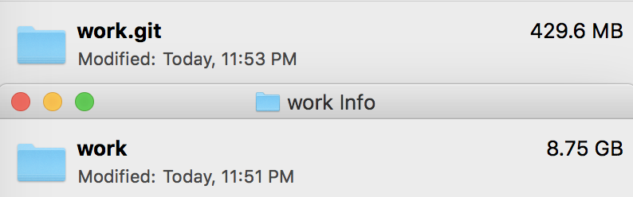

# 一个Git仓库管理多个Git项目

> 副标题: 一个Git仓库管理多个Git项目

## 目的

平时我会把所有需要储存的资料都用git进行管理.

我需要使用一个命令, 把工作中所有git仓库都提交到自己的阿里云或Dropbox上, 在不同的地方使用它.

使用git配合Dropbox的另外一个好处是, 由于 `.gitignore` 忽略了许多公共资源, Dropbox只需要储存很少的内容:




如图, 我的所有项目文件有8.75GB, 但是Dropbox上只保存着430MB的仓库, 并且还拥有Git的文件历史.

如果你有和我一样的需求, 这篇文章会帮到你.

## 需要解决问题
1. 每个Git仓库保留自己原有的Git功能, 并且不能有丝毫改动, 毕竟它们还需要保持平日的工作
2. Git Submodule 和 SubTree 对原有仓库有改动, 并且不能很好的实现以上需求
3. 有一个统一的仓库管理这些所有仓库
4. 最终需要仅仅一个简单的命令完成平时备份&拉取的工作

## 使用 merge-sub-gits 解决以上问题

### 安装

首先得确保当前有`Nodejs`环境, 安装 [merge-sub-gits](https://github.com/ymzuiku/merge-sub-gits)

```sh
npm install -g merge-sub-gits
```


### 原理及命令

思路很简单:
- 当git提交或拉取之前,把子git项目的`.git`文件夹重命名为`.__originGit__`文件夹,
- 当提交或拉取之后, 把`.__originGit__`文件夹重命名回`.git`

#### shell 命令

```sh
# 遍历当前目录子文件,把所有 .git 重命名为 .__originGit__
merge-sub-gits origin -l 

# 遍历当前目录子文件,把所有 .__originGit__ 重命名回 .git
merge-sub-gits local

# 打印重命名日志
merge-sub-gits xxx -l 
```

#### 提交项目

```sh
merge-sub-gits origin -l #遍历当前目录子文件,把所有 .git 重命名为 .__originGit__
git add .
git commit -m 'xxx'
git push
merge-sub-gits local #遍历当前目录子文件,把所有 .__originGit__ 重命名回 .git
```

其中添加 `-l` 参数会打印重命名日志

#### 拉取项目

```sh
merge-sub-gits 'origin' -l
git pull
merge-sub-gits 'local'
```

### 为以上操作设定`shell`快捷函数

每次都需要使用 `merge-sub-gits` 命令包括 git 提交操作很是繁琐, 我们可以在`~/.bash_profile`文件中添加以下内容:

```sh
# 递归修改子git项目, 从根git项目统一提交
function merge-sub-push(){
  merge-sub-gits 'origin' -l
  git add .
  if [ "$1" == "" ];then
    git commit -m "no commit message"
  else 
    git commit -m "$1 $2 $3 $4 $5 $6 $7 $8 $9"
  fi
  git push
  merge-sub-gits 'local'
}

# 拉取所有项目
function merge-sub-pull(){
  merge-sub-gits 'origin'
  git pull
  merge-sub-gits 'local' -l
}
```

#### 然后平时直接使用以下命令提交:

```sh
# 提交
merge-sub-push 修复了以下bug 1.xxx 2.xxx

# 拉取
merge-sub-pull
```

## 配合Dropbox或各类网盘使用

> 如果上文你已经看懂了, 并且有一些基本的Git使用经验, 下文就不需要继续阅读了, 相信你自己就可以使用 `merge-sub-gits` 完成目的.

我们平时会有需要把工作文件放入各类网盘中, 方便在公司和家里进行同步, 但是Dropbox\iCloud等网盘都没有给予文件夹忽略和更细腻的Git的文件历史.

例如一个React前端项目大概有几百MB, 如果忽略`node_modules`文件夹就只剩下几MB, 但是平时的项目如果每个都放入Dropbox, 会需要

我们可以把所有工作和电脑环境相关的资料都放入一个work文件, 使用`merge-sub-gits`把改文件夹的内容同步到网盘中:

#### 首先在Dropbox中创建一个 `backup-all.git` 仓库
```sh
# 使用iCloud就把仓库创建在: ~/Library/Mobile Documents/com~apple~CloudDocs/
# 使用Dropbox就把仓库创建在: ~/Dropbox

cd ~/Dropbox
git init --bare backup-all.git

# 在~目录克隆本地git
cd ~
git clone ~/Dropbox/backup-all.git

```
我们已经在Dropbox中创建了一个仓库, 并且clone到了本地, 接下来我们拷贝所有需要备份的文件都放入 `~/backup-all` 文件夹中, 然后继续下面的操作:

#### 使用 `merge-sub-gits` 进行备份
```
cd ~/backup-all

# 备份
# 记得提前创建.gitignore文件, 并且编写好需要忽略的内容
merge-sub-push

# 读取
merge-sub-pull
``` 
如前文所述, 通过.gitignore文件和git的压缩, 把8.75GB的内容, 变为430MB进行网盘管理, 并且还有Git的版本管理功能.

#### 清理Dropbox
由于Git仓库中保存了许多历史信息, 随着长时间的使用, Git 仓库会缓慢的逐步增大, 由于我们所有子项目都保留着自己的Git历史, 所以如果有一天根Git仓库太冗余了, 我们只需要删除Dropbox的Git,重新提交即可.

#### 修复已屏蔽的子git项目

如果曾经在根git项目中使用过`git commit`, 会把子git项目标记为忽略提交
这种情况需要清空git记录:

```sh
# 从当前分支替换并清空master分支
git checkout --orphan latest_master
merge-sub-gits 'origin' -l
git add .
git commit -m "clear master"
git branch -D master
git branch -m master
git push -f origin master
merge-sub-gits 'local'
```

## 使用到的库

欢迎 Star: [github.com/ymzuiku/merge-sub-gits](https://github.com/ymzuiku/merge-sub-gits)
